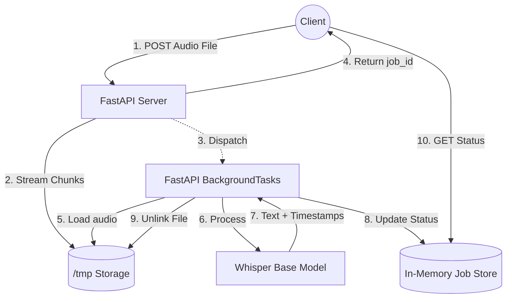

# Audio Transcription API

A lightweight, asynchronous REST API to process audio files and return transcriptions with timestamps, powered by OpenAI's Whisper model.

## Overview & Architecture

The API is built pragmatically using Python and FastAPI. Because transcriber models are CPU/GPU heavy and blocking, the system separates the ingestion of audio payloads from the actual machine learning inference. 

## Design Decisions

- **Immediate Acknowledgement**: To prevent timeouts, the `/api/v1/transcribe` endpoint accepts the upload, saves it to disk, and delegates the Whisper inference to a background threadpool. It returns a `job_id` instantly so the client can begin polling.
- **Minimal Footprint**: Uploads are chunked and streamed to disk (`/tmp`) to maintain low memory overhead securely. Temporary files are destroyed in the `finally` block of the task worker.
- **Lean Normalization**: Rather than writing custom `pydub` routines, the Python abstraction remains lean. Whisper inherently utilizes `ffmpeg` underneath to downmix to mono and resample to 16kHz across a multitude of audio containers (WAV, MP3, FLAC, M4A).
- **Architecture Caveats**: This implementation utilizes FastAPI's built-in `BackgroundTasks` alongside an in-memory dictionary for job state. 
  *(TODO: For a production deploy, state tracking should be moved to PostgreSQL/Redis, and background scheduling shifted to Celery/ARQ workers to ensure horizontal scalability).*

## Getting Started

### 1. System Requirements

Ensure you have Python 3.10+ and `ffmpeg` installed.

**macOS:**
\`\`\`bash
brew install ffmpeg
\`\`\`

**Ubuntu / Debian:**
\`\`\`bash
sudo apt-get update && sudo apt-get install ffmpeg
\`\`\`

### 2. Environment Setup

It is highly recommended to use a virtual environment:

\`\`\`bash
python -m venv .venv
source .venv/bin/activate
pip install -r requirements.txt
\`\`\`

### 3. Execution

Start the Uvicorn application server:

\`\`\`bash
uvicorn main:app --reload --port 8000
\`\`\`
*(Note: OpenAI's Whisper "base" model, roughly ~140MB, will automatically download into your cache during the initial run).*

## API Usage

### Submit an Audio File

\`\`\`bash
curl -X POST http://localhost:8000/api/v1/transcribe \
  -H "accept: application/json" \
  -H "Content-Type: multipart/form-data" \
  -F "file=@/path/to/your/audio.wav"
\`\`\`

**Response:**
\`\`\`json
{
  "job_id": "a1b2c3d4-e5f6-7890-1234-56789abcdef0",
  "status": "queued"
}
\`\`\`

### Check Job Status

Poll the job endpoint using the ID provided in the previous step:

\`\`\`bash
curl http://localhost:8000/api/v1/jobs/a1b2c3d4-e5f6-7890-1234-56789abcdef0
\`\`\`

**Response:**
*(Once completed, the 'status' updates and 'result' injects timestamps mapped to their respective segments)*
\`\`\`json
{
  "status": "completed",
  "result": {
    "transcription": "Hello, world. This is a test of the transcription system.",
    "segments": [
      {
        "start": 0.0,
        "end": 2.5,
        "text": "Hello, world."
      },
      {
        "start": 2.5,
        "end": 5.0,
        "text": "This is a test of the transcription system."
      }
    ]
  }
}
\`\`\`
